# Database Schema Overview

This document summarizes the core entities that power the LIMS/ELN platform and how they relate to each other. Use it as a reference when evolving the PostgreSQL schema, designing APIs, or coordinating application features.

## Entity Relationship Diagram

```mermaid
erDiagram
    %% Access Control
    ROLES {
        text role_name PK
        text display_name
        boolean is_assignable
        boolean is_system_role
        uuid created_by
    }
    USERS {
        uuid id PK
        citext email
        text full_name
        text default_role
        boolean is_active
        boolean is_service_account
    }
    USER_ROLES {
        uuid user_id PK
        text role_name PK
        uuid granted_by
        timestamptz granted_at
    }
    USER_TOKENS {
        uuid id PK
        uuid user_id
        text token_digest
        text allowed_roles
        timestamptz expires_at
        timestamptz revoked_at
        uuid created_by
        uuid revoked_by
    }

    %% Projects & Samples
    PROJECTS {
        uuid id PK
        text project_code
        text name
        uuid created_by
        timestamptz created_at
    }
    PROJECT_MEMBERS {
        uuid project_id PK
        uuid user_id PK
        text member_role
        uuid added_by
    }
    SAMPLE_STATUSES {
        text status_code PK
        text description
        boolean is_terminal
    }
    SAMPLE_TYPES_LOOKUP {
        text sample_type_code PK
        text description
        boolean is_active
    }
    SAMPLES {
        uuid id PK
        text name
        uuid project_id
        text sample_status
        text sample_type_code
        uuid created_by
        uuid collected_by
        uuid current_labware_id
        timestamptz collected_at
    }
    SAMPLE_DERIVATIONS {
        uuid id PK
        uuid parent_sample_id
        uuid child_sample_id
        text method
        uuid created_by
    }
    SAMPLE_LABWARE_ASSIGNMENTS {
        uuid id PK
        uuid sample_id
        uuid labware_id
        uuid labware_position_id
        uuid assigned_by
        timestamptz released_at
    }

    %% Labware & Custody
    LABWARE_TYPES {
        uuid id PK
        text name
        integer capacity
        boolean is_disposable
    }
    LABWARE {
        uuid id PK
        uuid labware_type_id
        text barcode
        text status
        uuid current_storage_sublocation_id
        uuid created_by
    }
    LABWARE_POSITIONS {
        uuid id PK
        uuid labware_id
        text position_label
        integer row_index
        integer column_index
    }
    LABWARE_LOCATION_HISTORY {
        uuid id PK
        uuid labware_id
        uuid storage_sublocation_id
        uuid moved_by
        timestamptz moved_at
    }
    CUSTODY_EVENT_TYPES {
        text event_type PK
        text description
        boolean requires_destination
    }
    CUSTODY_EVENTS {
        uuid id PK
        uuid sample_id
        uuid labware_id
        uuid from_sublocation_id
        uuid to_sublocation_id
        text event_type
        uuid performed_by
        timestamptz performed_at
    }

    %% Storage & Inventory
    STORAGE_FACILITIES {
        uuid id PK
        text name
        text location
    }
    STORAGE_UNITS {
        uuid id PK
        uuid facility_id
        text name
        text storage_type
    }
    STORAGE_SUBLOCATIONS {
        uuid id PK
        uuid unit_id
        uuid parent_sublocation_id
        text name
        text barcode
    }
    INVENTORY_ITEMS {
        uuid id PK
        text name
        numeric quantity
        uuid storage_sublocation_id
        uuid created_by
    }
    INVENTORY_TRANSACTION_TYPES {
        text transaction_type PK
        text direction
        text description
    }
    INVENTORY_TRANSACTIONS {
        uuid id PK
        uuid inventory_item_id
        text transaction_type
        numeric quantity_delta
        uuid performed_by
        timestamptz performed_at
    }

    %% Audit
    AUDIT_LOG {
        bigint id PK
        timestamptz ts
        uuid actor_id
        text table_name
        text action
    }

    %% Relationships
    ROLES ||--o{ USER_ROLES : grants
    USERS ||--o{ USER_ROLES : holds
    ROLES ||--o{ USERS : "default_role (optional)"
    USERS ||--o{ USER_TOKENS : issues
    USERS ||--o{ PROJECTS : "created_by (optional)"
    USERS ||--o{ PROJECT_MEMBERS : participates
    PROJECTS ||--o{ PROJECT_MEMBERS : includes
    PROJECTS ||--o{ SAMPLES : contains
    SAMPLE_STATUSES ||--o{ SAMPLES : classifies
    SAMPLE_TYPES_LOOKUP ||--o{ SAMPLES : types
    USERS ||--o{ SAMPLES : "created/collected"
    LABWARE ||--o{ SAMPLES : "current_labware (optional)"
    SAMPLES ||--o{ SAMPLE_DERIVATIONS : parent
    SAMPLES ||--o{ SAMPLE_DERIVATIONS : child
    SAMPLES ||--o{ SAMPLE_LABWARE_ASSIGNMENTS : assigned
    LABWARE ||--o{ SAMPLE_LABWARE_ASSIGNMENTS : holds
    LABWARE_POSITIONS ||--o{ SAMPLE_LABWARE_ASSIGNMENTS : positions
    USERS ||--o{ SAMPLE_LABWARE_ASSIGNMENTS : assigns
    LABWARE_TYPES ||--o{ LABWARE : defines
    STORAGE_SUBLOCATIONS ||--o{ LABWARE : stores
    USERS ||--o{ LABWARE : "created_by (optional)"
    LABWARE ||--o{ LABWARE_POSITIONS : positions
    LABWARE ||--o{ LABWARE_LOCATION_HISTORY : movement
    STORAGE_SUBLOCATIONS ||--o{ LABWARE_LOCATION_HISTORY : location
    USERS ||--o{ LABWARE_LOCATION_HISTORY : moves
    SAMPLES ||--o{ CUSTODY_EVENTS : tracked
    LABWARE ||--o{ CUSTODY_EVENTS : container
    STORAGE_SUBLOCATIONS ||--o{ CUSTODY_EVENTS : from_location
    STORAGE_SUBLOCATIONS ||--o{ CUSTODY_EVENTS : to_location
    CUSTODY_EVENT_TYPES ||--o{ CUSTODY_EVENTS : typed
    USERS ||--o{ CUSTODY_EVENTS : performs
    STORAGE_FACILITIES ||--o{ STORAGE_UNITS : houses
    STORAGE_UNITS ||--o{ STORAGE_SUBLOCATIONS : subdivides
    STORAGE_SUBLOCATIONS ||--o{ STORAGE_SUBLOCATIONS : parent
    STORAGE_SUBLOCATIONS ||--o{ INVENTORY_ITEMS : stores
    USERS ||--o{ INVENTORY_ITEMS : "created_by (optional)"
    INVENTORY_ITEMS ||--o{ INVENTORY_TRANSACTIONS : has
    INVENTORY_TRANSACTION_TYPES ||--o{ INVENTORY_TRANSACTIONS : typed
    USERS ||--o{ INVENTORY_TRANSACTIONS : performs
```

## Key Domain Areas
- Access control: roles, users, API tokens, and membership tables govern authentication, authorization, and delegation.
- Projects & samples: projects own specimens, while sample statuses, types, lineage, and labware assignments capture lifecycle and tracking.
- Labware & custody: labware metadata and custody events describe where samples live, who touches them, and how they move.
- Storage & inventory: facilities, units, sublocations, and inventory entities manage both storage hierarchy and consumable stock levels.
- Audit trail: every high-value change is journaled in `lims.audit_log` for compliance, troubleshooting, and analytics.

## Seeded Workflow Example: DNA Intake To Sequencing
- **DNA intake (plates `PLATE-DNA-0001`/`0002`)**: six samples named `DNA Intake Batch 00X - Donor YYY` model a multi-plate delivery. Each sample is typed as `dna`, linked to project `PRJ-002`, and assigned to distinct wells on the intake plates so labware dashboards show realistic occupancy.
- **Indexed libraries (`PLATE-LIB-0001`)**: for every intake record the seed inserts a derived `library` sample `Indexed Library Batch 00X - Donor YYY`. Sample derivations with method `workflow:indexed_library_prep` connect the intake DNA to its indexed library, and labware assignments place the libraries in row A/B of the shared library plate.
- **Sequencing pool (`POOL-SEQ-0001`)**: `Sequencing Pool Run 001` aggregates all six indexed libraries through `workflow:library_pooling` derivations. The pooled library is stored in a disposable 2 mL vessel, ready to be scheduled for sequencing or custody events in downstream tests.
