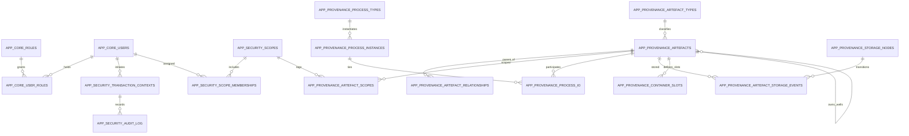

# Database Schema Overview – Phase 2 Redux

The Phase 2 Redux migrations extend the security-focused foundation from Phase 1 into a working provenance domain that the UI and APIs can exercise end-to-end. Three schemas collaborate:

- **`app_core`** keeps the canonical list of users and persona assignments.
- **`app_security`** captures scopes, transaction contexts, audit trails, and automation clients.
- **`app_provenance`** models artefacts, processes, containment, storage, and lineage, all under row-level security.

The sections below summarise the most important structures, helper functions, and views that are now available.

---

## Cross-Schema Relationships (Mermaid ER)

---

## `app_core` – People & Personas

| Table | Purpose | Highlights |
| --- | --- | --- |
| `roles` | Canonical persona catalogue | `role_name` primary key; `is_system_role`, `is_assignable` flags; managed by admin RLS policy |
| `users` | End users & service accounts | Lifecycle columns (`is_active`, `is_service_account`, `created_at/updated_at`), JSONB `metadata`, audited via `app_security` triggers |
| `user_roles` | Persona grants | `user_id` + `role_name` composite key; `granted_by`, `granted_at`; enforcement via RLS (admins only) |

All `app_core` tables inherit the transaction-context audit trigger. Reads for non-admins are restricted to the actor’s own `users` row.

---

## `app_security` – Scope & Audit Fabric

| Table | Purpose | Highlights |
| --- | --- | --- |
| `scopes` | Hierarchical access scopes (facility, project, workflow, dataset, etc.) | `scope_key`, `scope_type`, `parent_scope_id`, `metadata`; supports cascading access |
| `scope_memberships` | Bind users to scopes with a role | `role_name` references `app_core.roles`; optional expiry; RLS enforces admin-only writes |
| `scope_role_inheritance` | Propagate roles down the scope tree | Defines mappings such as facility → project → workflow |
| `transaction_contexts` | One per request/write | Records actor id/identity/roles, client metadata, status (`committed`, `rolled_back`, etc.), JSON `metadata` |
| `audit_log` | Immutable row-level history | Stores before/after snapshots, PK diff, actor metadata; linked to `transaction_contexts` |
| `api_clients` / `api_tokens` | Automation identities | Tokens stored as SHA-256 digests with hints; creation via `app_security.create_api_token` |

### Helper Functions

- `app_security.pre_request(jwt_claims jsonb)` – Projects JWT claims into session GUCs before RLS runs.
- `app_security.start_transaction_context(...)` – Creates the context row that audit triggers rely upon.
- `app_security.finish_transaction_context(txn_id, status, reason)` – Marks the context at commit/rollback.
- `app_security.session_has_role(role)` / `app_security.has_role(role)` – Resolve session-roles, respecting both PostgreSQL role membership and `app.roles` GUC.
- `app_security.actor_scope_roles(actor_id)` & `app_security.actor_has_scope(scope_id, required_roles)` – Scope resolution used by the provenance helpers.

Views `app_security.v_transaction_context_activity` and `app_security.v_audit_recent_activity` provide operator-friendly snapshots of recent work.

---

## `app_provenance` – Artefact & Workflow Domain

### Core Catalogue

| Table | Purpose | Highlights |
| --- | --- | --- |
| `artefact_types` | Define material/container/data types | `type_key`, `kind` (`material`, `container`, `data`, etc.), display metadata |
| `artefact_traits` & `artefact_trait_values` | Flexible attributes | Traits described once, values keyed by `artefact_id` + `trait_id`; supports numeric, boolean, text |
| `artefacts` | Unified artefact model | Links to `artefact_types`; includes `status`, `metadata`, `origin_process_instance_id`, audit coverage; physical material stores `container_artefact_id` / `container_slot_id` to anchor wells |

### Processes & Lineage

| Table | Purpose | Highlights |
| --- | --- | --- |
| `process_types` / `process_instances` | Describe workflow steps | Instances capture timing, status, metadata, and acting user |
| `process_io` | Input/output mapping for processes | Associates artefacts to process instances with IO role metadata |
| `artefact_relationships` | Direct lineage edges | Stores parent → child relationships with `relationship_type` (`culture:passage`, `analysis:panel_build`, etc.) |

### Containment & Storage

The containment layer now models wells as artefacts instead of maintaining a separate assignment table. A plate artefact owns a set of well artefacts (A01…H12) that inherit their positional metadata from `container_slots`. Each well artefact persists its `container_artefact_id` and `container_slot_id`, so labware lookups and quantity updates operate on the same row that holds QC traits and measurements.

| Table | Purpose | Highlights |
| --- | --- | --- |
| `container_slot_definitions` / `container_slots` | Physical layout of labware | Slot definitions provide the blueprint; slots can be instantiated per container artefact |
| Physical well artefacts | One artefact per instantiated slot | Wells inherit coordinates from `container_slots` but live in `app_provenance.artefacts`; `container_slot_id` is unique per artefact; traits capture volume, concentration, fragment metrics, QC status |
| `storage_nodes` | Hierarchical storage tree | Facility → unit → sublocation; joins into `app_security.scopes` |
| `artefact_storage_events` | Movement history | `from_storage_node_id`, `to_storage_node_id`, `event_type`, actor and reason; audit-triggered |

### Scope Bridges

- `artefact_scopes` and `process_scopes` associate artefacts/processes with scopes (`relationship` column designates `primary`, `facility`, etc.).
- `app_provenance.can_access_artefact`, `can_access_process`, and `can_access_storage_node` wrap the scope logic; every RLS policy references these helpers.

### Views

| View | Purpose |
| --- | --- |
| `v_artefact_current_location` | Latest storage node per artefact |
| `v_container_contents` | Slot-level labware roster with sample metadata |
| `v_accessible_artefacts` | Artefacts filtered by `can_access_artefact` for lightweight listings |

---

## Phase 2 Convenience Views (`app_core`)

| View | Description |
| --- | --- |
| `v_sample_overview` | Aggregates artefact metadata, project scope, current labware, storage path, and derivative summary for materials |
| `v_labware_contents` | Slot-by-slot view of active labware assignments |
| `v_labware_inventory` | Labware-level inventory metrics (barcode, type, sample count, storage location) |
| `v_inventory_status` | Reagent/consumable quantities with threshold & expiry calculations |
| `v_sample_lineage` | Parent ↔ child relationships with labware context and process information |
| `v_project_access_overview` | Projects the current actor can reach, including implicit access through artefacts or labware (`access_via = direct | inherited | implicit`) |
| `v_storage_tree` | Facility/unit/sublocation hierarchy with aggregate labware & sample counts |
| `v_transaction_context_activity` / `v_audit_recent_activity` | Operator dashboards sourced from the audit tables |

These views are exposed to the `app_auth` role group so PostgREST/PostGraphile can surface them directly. Each view internally calls the provenance access helpers to avoid leaking out-of-scope artefacts even if underlying tables are filtered by RLS.

---

## Seed Data & Personas

Migration `20251010013000_phase2_redux_seed.sql` loads a representative dataset for demos and automated tests:

- Personas: `admin@example.org`, `ops@example.org`, `alice@example.org`, `carol@example.org`, `diego@example.org`, `bob@example.org`, plus automation/external fixtures. Roles are granted through `app_core.user_roles` and the scope fabric.
- Scopes: facility (`facility:main_biolab`), projects (`project:prj-001` .. `prj-003`), and derived workflow scopes seeded with rich metadata.
- Artefacts: a multi-step lineage covering blood draw, organoid, sequencing prep, and QC materials; labware assignments across plates, tubes, and pools; storage events into freezer shelves.
- Convenience fixtures ensure the RBAC smoke tests in `scripts/test_rbac.sh` can validate researcher vs. operator access patterns.

Run `make jwt/dev` to generate matching JWT fixtures under `ui/public/tokens` for all personas (including Bob).

---

## Auditing & Transaction Flow Recap

1. **Session priming** – API gateways call `app_security.pre_request()` to populate `app.actor_id`, `app.actor_identity`, and `app.roles`.
2. **Transaction context** – For writes, call `app_security.start_transaction_context(...)`; PostgREST/PostGraphile do this automatically. Reads may skip it.
3. **Row changes** – Audit triggers (`app_security.require_transaction_context()` + `app_security.record_audit()`) fire on `INSERT/UPDATE/DELETE`, pulling actor metadata from the context row.
4. **Completion** – A deferred trigger stamps `finished_status` = `committed` at transaction end unless a caller set an alternate status via `finish_transaction_context`.

All provenance tables participate in the same audit pipeline, so every change is traceable back to the initiating user, scope, and client.

---

## Useful References

- `ops/db/tests/security.sql` – psql-based regression for RBAC policies.
- `scripts/test_rbac.sh` – End-to-end smoke covering PostgREST and PostGraphile using seeded JWT fixtures.
- `ops/db/migrations/20251010013500_expand_provenance_examples.sql` – Detailed seed script showing how scopes, artefacts, labware, and storage events interrelate.

This document reflects the schema as of migration `20251010014000_phase2_redux_convenience_views.sql`. Re-run `make db/reset` followed by `make test/security` to validate that both the database structure and the RBAC expectations continue to align with the documentation.
