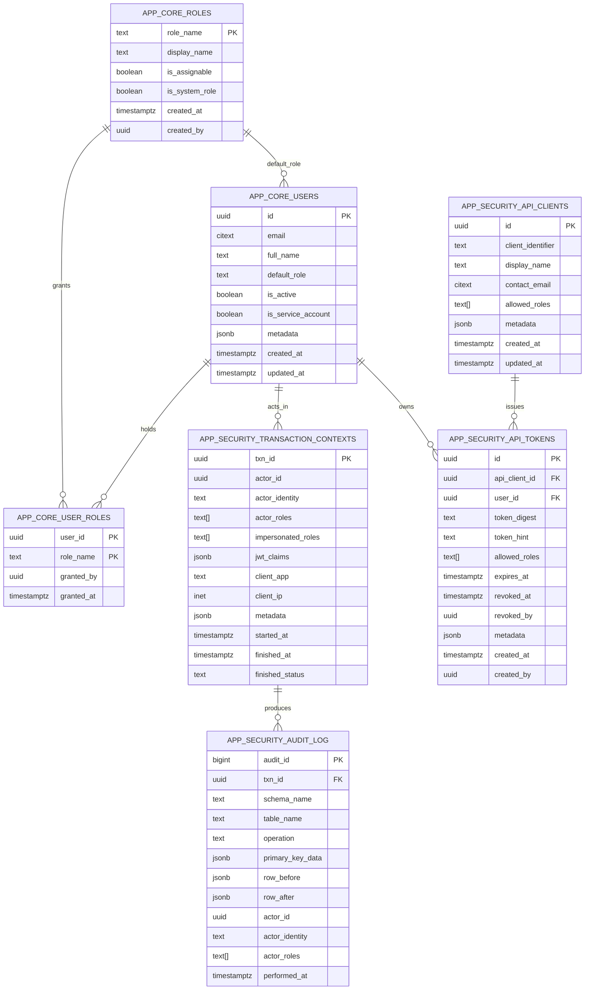

# Database Schema Overview – Phase 1 Redux

Phase 1 Redux narrows the schema to the security primitives that everything else will build upon. The goal is to guarantee that every write is attributable to a transaction context with consistent actor metadata, while keeping RBAC and auditing reusable for downstream domains.

## Schemas & Tables

- **app_core.roles** – canonical list of personas (`role_name`, `display_name`, flags for system/assignable).
- **app_core.users** – end users and service accounts, including metadata and lifecycle columns.
- **app_core.user_roles** – grants linking users to personas, capturing the granting actor and timestamp.
- **app_security.transaction_contexts** – one row per request/write transaction; records actor identifiers, roles, JWT snapshot, client metadata, and completion status (`committed`, `rolled_back`, `cancelled`).
- **app_security.audit_log** – immutable row-level history generated by triggers, keyed to `txn_id` so changes can be reconstructed in context.
- **app_security.api_clients** – registry of automation/instrumentation clients and their allowed roles.
- **app_security.api_tokens** – hashed API tokens tied to a user + optional API client, with revocation metadata.

## Entity Relationship Diagram

## Session & Transaction Flow

1. **JWT intake** – PostgREST/PostGraphile should call `app_security.pre_request()` to project JWT claims into session GUCs like `app.actor_id`, `app.actor_identity`, and `app.roles`.
2. **Explicit context** – PostgREST automatically calls `app_security.start_transaction_context(...)` for write verbs during its pre-request hook. Other clients can call the helper directly; if they forget, the audit trigger’s call to `app_security.require_transaction_context()` will backfill the row using the current session GUCs before the first DML executes.
3. **Row mutations** – Audit triggers on `app_core.*` and `app_security.api_*` tables call `app_security.require_transaction_context()` and then capture `row_before`/`row_after` snapshots alongside the primary key diff, falling back to the context GUCs for actor attribution.
4. **Completion** – A deferrable constraint trigger (`trg_mark_transaction_committed`) stamps `finished_status='committed'` and `finished_at` at commit time. Workflows that need alternate statuses can call `app_security.finish_transaction_context(txn_id, status, reason)` before the transaction completes.

Contexts provide a stable join key (`txn_id`) that operations, support, and compliance can use to reconstruct exactly what happened during any write.

## RBAC & RLS Summary

- Database roles (`app_admin`, `app_operator`, `app_researcher`, `app_external`, `app_automation`) inherit from `app_auth` and are minted via the bootstrap migration.
- `app_security.pre_request()` and `start_transaction_context()` both normalise the effective role list into `app.roles` so RLS predicates can rely on `app_security.has_role('role_name')`.
- Policies:
  - `app_core.roles` – world-readable, but only admins can insert/update/delete.
  - `app_core.users` – admins manage all rows; non-admin access is limited to the actor’s own user record.
  - `app_core.user_roles` – admins only.
  - `app_security.api_clients` / `api_tokens` – admins only.
  - `app_security.audit_log` – admins only (via RLS) with the companion views `app_security.v_transaction_context_activity` and `app_security.v_audit_recent_activity` exposed for operational dashboards.

RLS assumes that session settings are present; if you bypass `pre_request` or `start_transaction_context`, reads may succeed but writes will fail when the audit trigger asserts the missing context.

## Phase 2 Redux – Unified Artefact & Provenance Platform

- **Scope fabric** – `app_security.scopes`, `scope_memberships`, and `scope_role_inheritance` generalise access control beyond persona grants. Helpers `app_security.actor_scope_roles`, `app_security.actor_has_scope`, and the new `app_security.session_has_role` resolve the scopes the active session may read/write without relying on definer privileges.
- **Domain schema (`app_provenance`)**
  - `artefact_types`, `artefact_traits`, and `artefact_trait_values` describe configurable metadata for subjects, materials, reagents, containers, instrument runs, and data products.
  - `artefacts`, `process_instances`, `process_types`, `process_io`, and `artefact_relationships` form the provenance graph, capturing lineage, pooling, and process IO roles.
  - Containment and custody tables (`container_slot_definitions`, `container_slots`, `artefact_container_assignments`, `storage_nodes`, `artefact_storage_events`) track where artefacts are stored, when they move, and who performed the action. Every table is covered by the transaction-context audit trigger.
  - Linking tables `artefact_scopes` and `process_scopes` bridge domain entities into the scope fabric so RLS can gate access by project, dataset, facility, or workflow-run.
- **Access helpers & policies** – `app_provenance.can_access_artefact`, `can_access_process`, and `can_access_storage_node` centralise scope-aware checks and are referenced by every RLS predicate. Only `app_admin` bypasses scope checks; operators and automation accounts must hold explicit membership.
- **Views for downstream clients** – `app_provenance.v_accessible_artefacts` exposes only artefacts the current actor can reach (filtered both by RLS and a view-level predicate), while `v_container_contents` and `v_artefact_current_location` supply inventory snapshots for UI/reporting flows.
- **Seed fixtures** – `20251010013000_phase2_redux_seed.sql` introduces a synthetic pilot project (project → dataset → workflow-run plus facility scope) with scoped memberships, artefact lineage, container assignments, storage history, and sample data for researcher, operator, and admin personas.

### Operational Notes

- `app_security.has_role` now delegates to `session_has_role`, so scope decisions match the active session even inside security-definer helpers.
- Automated tests (`ops/db/tests/security.sql`) exercise researcher/operator personas against the new provenance data: researchers can see dataset-scoped artefacts but not facility-only reagents/containers, and operators can register custody events under a transaction context.
- `app_provenance.v_accessible_artefacts` applies `app_provenance.can_access_artefact` in addition to table-level RLS to guarantee that API clients never receive artefacts outside their scopes.

## API Token Lifecycle

1. Create (or reuse) an `app_security.api_clients` row describing the automation caller and the roles it may impersonate.
2. Call `app_security.create_api_token(user_id, plaintext_token, allowed_roles, expires_at, metadata, client_identifier)` from an admin context.
3. Store the plaintext token securely on the caller’s side; only the SHA-256 digest + 6-character hint are retained in the database.
4. Revoke tokens via `revoked_at`/`revoked_by` or hard deletion. All mutations continue to flow through the transaction context + audit trigger pipeline.

## Next Steps

- Extend provenance coverage into ELN/task orchestration (Phase 3) using the scope fabric created here.
- Add masking/column policies to `app_security.record_audit()` for sensitive trait values.
- Produce operational runbooks that stitch together transaction contexts, scope membership, and artefact lineage for human review.
